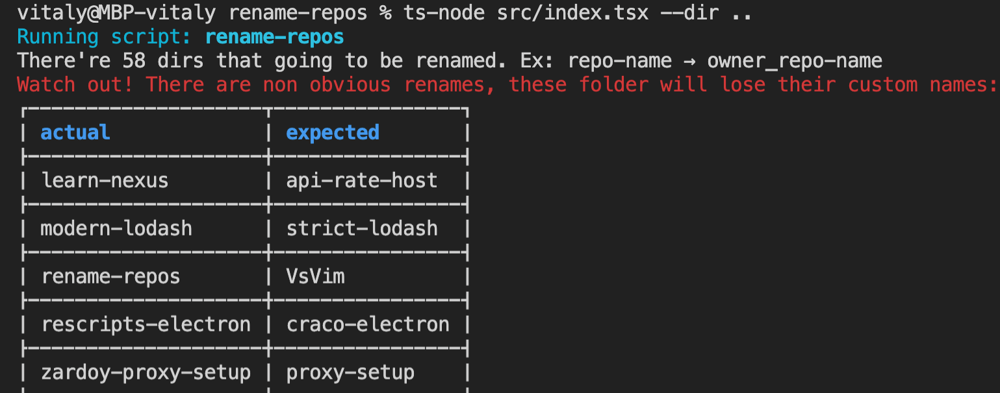

# Owner-name repos

Advanced utility for managing names of your cloned repos from GitHub.

## What is does?

> Note: I don't really maintain this utility, but it's alive

This is the most comprehensive CLI to:

- Rename repos to `owner_repo-name` template. Ex: `vscode-eslint` into `microsoft_vscode-eslint`.<!--  or other template (`--template YOUR_TEMPLATE`) -->
- If you recently renamed a lot repos on GitHub you can run `update-names-from-github` action (note that `GITHUB_TOKEN` env must be set with at least `public_repo` scope) to update local names of repos (all folders from cwd) to match GitHub repo names.

## Philosophy

By default, `git clone` and even `gh repo clone` chooses the name for the directory just *repo name*, but if you need to clone (for some reason) forks of different people.
And yes, I still prefer to clone every repo locally rather than work with them [remotely](https://docs.github.com/en/codespaces/developing-in-codespaces/using-codespaces-in-visual-studio-code).
